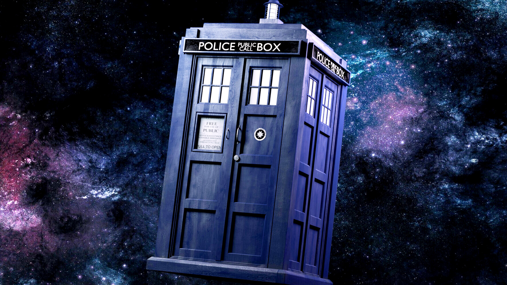

# Tardis Console

Welcome to the Tardis Console! This application fetches and displays random characters from the Doctor Who universe, providing fans with a fun way to explore the show's vast array of characters.



## Table of Contents

- [Features](#features)
- [Installation](#installation)
- [Usage](#usage)
- [Technologies Used](#technologies-used)
- [Contact](#contact)

## Features

- Fetches and displays random Doctor Who characters.
- Uses a Doctor Who API to get character data.
- Simple and intuitive user interface.

## Installation

To run this project locally, follow these steps:

1. Clone the repository:
   ```bash
   git clone https://github.com/yourusername/doctor-who-random-character-app.git
   ```
2. Navigate to the project directory:
   ```bash
   cd tardis-console
   ```
3. Install the dependencies:
   ```bash
   npm install
   ```
4. Start the application:
   ```bash
   npm start
   ```
5. Open `localhost:3000` in your preferred web browser.

## Usage

1. Open the app in your web browser.
2. Click the "Show Character" button.
3. Enjoy the random character data displayed on the screen.

## Technologies Used

- HTML5
- CSS3
- JavaScript
- [Doctor Who API](#https://github.com/Ido-Barnea/Doctor-Who-API)

## Contact

If you have any questions or feedback, feel free to reach out:

- **Your Name**
- **Email:** som.ramnani@gmail.com
- **GitHub:** [somramnani](https://github.com/somramnani)
